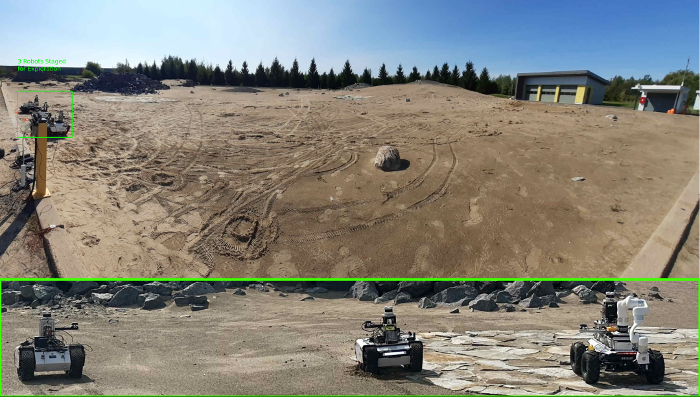
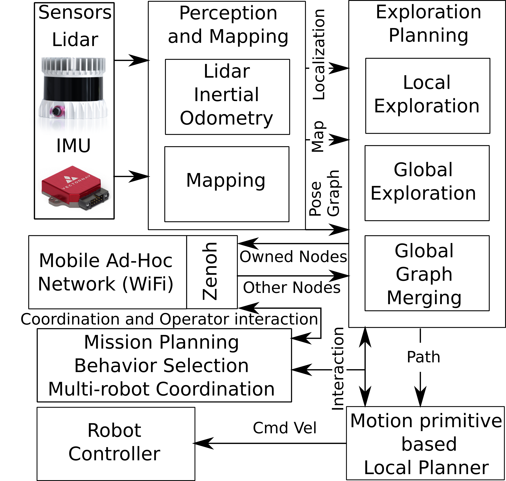

# Multi-robot Grid Graph Exploration Planner

The exploration planner builds on top of exsisting planners to enable merging global planning graphs among multiple robots and increases the planning speed by employing grid based local exploration planning.



Local exploration planning graph


Global graph built during exploration planning


## Installation
These instructions assume that ROS desktop-full of the appropriate ROS distro is installed.

Install necessary libraries:

For Ubuntu 20.04 and ROS Noetic:
```bash

sudo apt install python3-catkin-tools \
libgoogle-glog-dev \
ros-noetic-joy \
ros-noetic-twist-mux \
ros-noetic-interactive-marker-twist-server \
ros-noetic-octomap-ros
```


Create the workspace:
```bash
mkdir -p mggplanner_ws/src/exploration
cd mggplanner_ws/src/exploration
```
Clone the planner
```bash
git clone https://github.com/MISTLab/MGGPlanner.git
```

Clone and update the required packages:
```bash
cd <path/to/mggplanner_ws>
wstool init
wstool merge ./src/exploration/MGGPlanner/packages_https.rosinstall
wstool update
```

`Note: ./src/exploration/MGGPlanner/packages_https.rosinstall is for https urls.`

Build:
```bash
catkin config -DCMAKE_BUILD_TYPE=Release
catkin build
```

## Running MGG Planner Simulations 

### Single Robot Simualation

Launching simulation in the pittsburgh mine environment
```bash
roslaunch mggplanner mgg_sim_flat.launch
```
Launching simulation in the darpa cave
```bash
roslaunch mggplanner mgg_sim_darpa_cave.launch
```

### Multi-robot Simulations
To launch three robot simulations:
```bash
roslaunch mggplanner 3smb_sim_mgg.launch
```
In Ubuntu 18.04 with ROS Melodic, the gazebo node might crash when running the ground robot simulation. In this case set the `gpu` parameter to false [here](https://github.com/ntnu-arl/smb_simulator/blob/6ed9d738ffd045d666311a8ba266570f58dca438/smb_description/urdf/sensor_head.urdf.xacro#L20).

## ROS 2 port: exploration gain

In the ROS 2 port (`ros2/src`), a viewpoint's gain counts the unknown voxels its sensor could reveal from there (`mgg_core/src/gain.cpp`):

- Each voxel counts once per viewpoint, however many rays cross it.
- For a ground robot, rays start at its sensor, `SensorParams.<name>.mount_height` over the ground under the vertex and `center_offset`'s x and y from the body centre (0 casts from the vertex). Only voxels up to the local floor plus `RobotParams.size.z` plus `PlanningParams.ground_frontier_height_margin` (default 0.5 m) contribute to gain. Unknown upper walls and ceilings cannot hold a ground robot in an explored room. The sensor still casts from its mount, including above this band.
- A ground vertex is a frontier only when band unknown times map resolution is at least 0.5 m (three 0.2 m voxels). Non-frontiers have zero gain; ground gain clustering is disabled to preserve viewpoint-local evidence. Aerial gain remains full 3D: a vertex is a frontier when its distinct unknown voxels are at least `frontier_percentage_threshold` of those an all-unknown scan from a voxel centre reaches (`SensorParams::uniqueVoxelsFullFov`, `mgg_core/voxel_walk.h`).
- Native MOLA ground scans stop beyond the height band and conservative gain-region bounds, retaining occlusion before entering the band and exact per-viewpoint voxel counts. `PlanningParams.ground_gain_full_scan: true` disables pruning for diagnostics/reference comparisons (default false); production logs total unknown as `unavailable (pruned)`, not zero. Backends without bounds-aware scanning fall back to full scans.
- Below the vertex's floor, a voxel counts unless mapped ground lies over it. Ground falling away, such as a ramp down or a stairwell, keeps its gain down to `max(2 max_ground_height, 1 m)` below the vertex.

Optional ground-only ranking parameters, independent of the real sensor/body-FOV geometry:

```yaml
PlanningParams:
  ground_gain_angular_resolution_deg: 7.5
  ground_gain_max_range: 10.0
  ground_gain_full_scan: false
```

Both overrides default to **0** (inherit the dense sensor). The measured opt-in recommendation is **7.5 degrees / 10 m with pruning**: it retains the room/door and Scout/Bunker/Spot corridor regressions at 0.1/0.2 m. The worst 0.2 m Scout corridor clears the 9000 path-score floor by only 3.3%; use 5 degrees / 10 m if more score margin is needed. A 10-degree fleet default is **not recommended**: it drops some 0.2 m corridor scores below that floor. Sparse models intentionally change counts and may change tour/path choices; they are not exact substitutes for dense gain. The real sensor FOV/range and aerial gain stay unchanged, and obstacle ray steps remain one voxel. `ground_gain_full_scan` disables pruning of the selected gain model; set both overrides to zero as well for the original dense reference. Orin timings remain to be measured.

Ground receivers must configure `aerial_peer_robot_ids` with an integer array of the aerial senders' **wire IDs** (`PlanningParams.robot_id` / `Vertex.robot_id`), not namespace names. For example, `aerial_peer_robot_ids: [5]` excludes sender ID 5 from ground global repositioning, tour clusters and fleet target offers, including after rebroadcast. The fleet launch must supply this list; it is logged at startup. The default empty list preserves legacy peer behavior: unlisted peers are treated as ground. This avoids changing `Graph.msg` and permits roadmap exchange with older robots. Aerial receivers ignore the exclusion; their own gain is unchanged, but band-only ground-peer counts can put some shared targets below the drone's tour gain floor.

## Results

Software Architecture Used During the Deployments


Deployment Arena 


Three robots were deployed in a Mars-analog environment, using the MGG planner to coordinate with one another and distribute across the environment without any predefined exploration preferences.


## References

### Explanation Video
[](https://youtu.be/Fv8B0Ml0KCY)

If you use this work in your research, please cite the following publications:

**MGG planner tests in a Mars analogs environment**
```
@article{vvaradharajan2025,
  title={A Multi-Robot Exploration Planner for Space
Applications},
  author={Varadharajan and Vivek Shankar, Beltrame and Giovanni},
  journal={IEEE Robotics and Automation letters},
  volume = {},
  number = {},
  pages = {},  
  year={2025}
}
```

You can contact us for any question:
* [Vivek Shankar Varadharajan](mailto:vivek-shankar.varadharajan@polymtl.ca)
* [Giovanni Beltrame](mailto:giovanni.beltrame@polymtl.ca)

We acknowledge the contributions of the authors of gbplanner2, and our planner (MGGplanner) has been built on top of gbplanner2's codebase. 